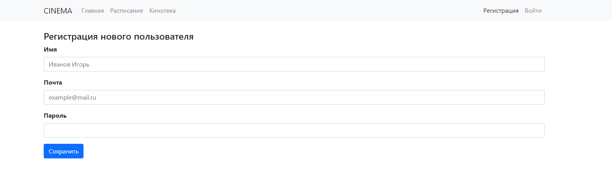
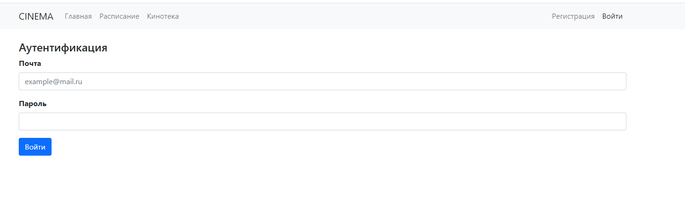
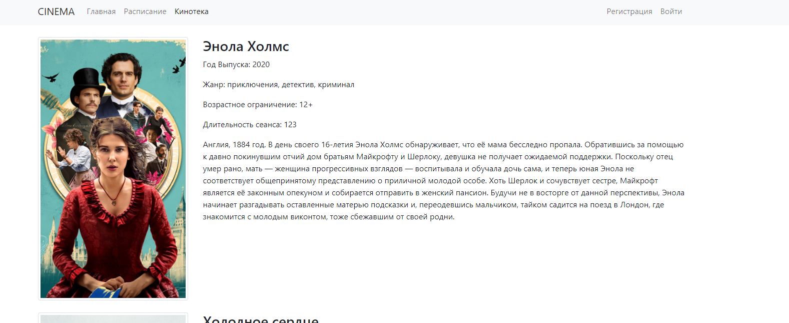
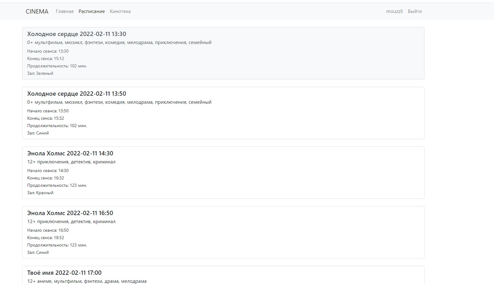
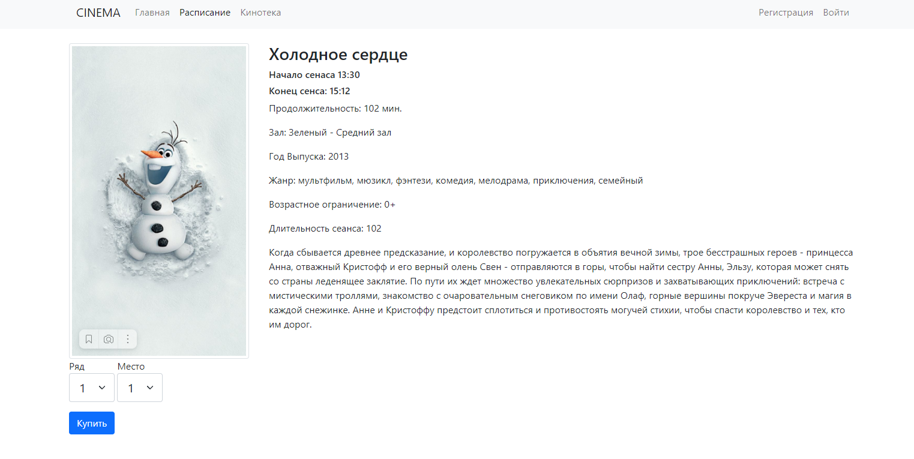
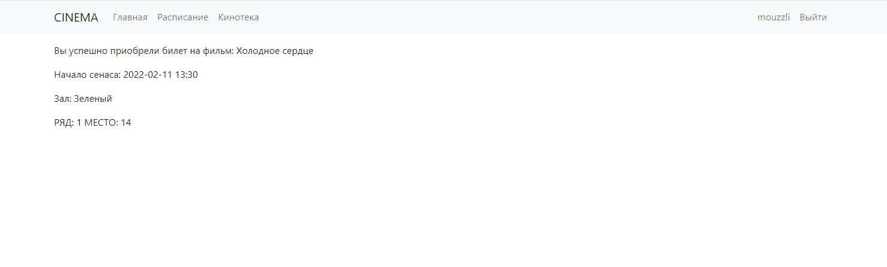

# Job4j_Cinema
[](https://github.com/mouzzli/job4j_cinema/actions/workflows/build.yml)

## Описание проекта
Сайт по покупке билетов в кино. Реализована возможность выбора конкретного сеанса и места.
При нажатии кнопки купить, если выбранные места не заняты выводится информация о купленном билете.

## Стек технологий
+ **Java 17**
+ **Spring Boot 2.7.6**
+ **Maven 4.0.0**
+ **Liquibase 4.17.0**
+ **Базы Данных - PostgreSql 42.5.1, H2database 2.1.214**
+ **SQL2O**
+ **Apache Commons DBCP 2.9.0**
+ **maven-checkstyle-plugin 3.12.1**
+ **Thymeleaf 3.0.15**
+ **Bootstrap 5**
+ **Mockito 4.8.0**
+ **Jacoco 0.8.8**

## Требования к окружению
+ **Java 17** 
+ **Maven 4.0.0**
+ **Postgres 14**

## Запуск проекта

Создать базу данных с названием cinema
```
create database cinema;
```

Данные подключения к БД хранятся по пути src/main/resources/application.properties
```
datasource.url=jdbc:postgresql://127.0.0.1:5432/cinema
datasource.username=postgres
datasource.password=password
```
Собрать и запустить проект
```
mvn clean install
mvn spring-boot:run
```

## Взаимодействие с приложением
+ **Регистрация и Аутентификация пользователя**


+ **Кинотека страница со списком фильмов**

+ **Расписание сеансов**

+ **Выбор ряда и места**

+ **Информация о купленном билете**


## Контакты
+ Telegram: @mouzzli
+ email: chumacoin@gmail.com


